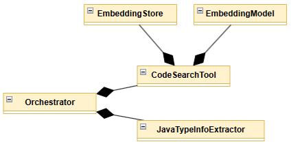
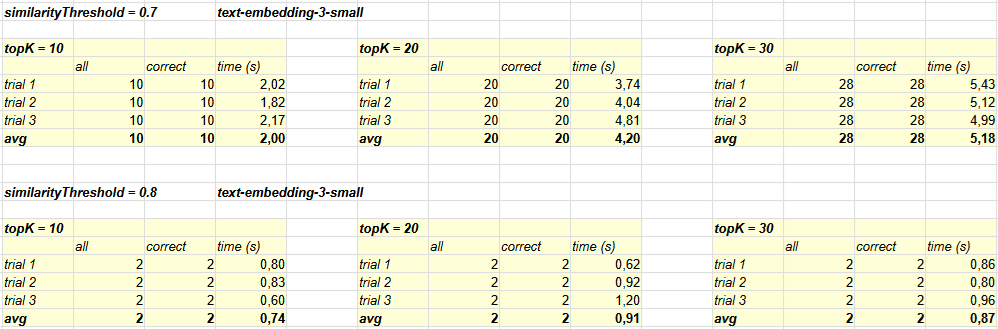

# Changes in agentic-ast Relative to agentic-llm

The **agentic-ast** application is an extension of the example
[agentic-llm](../../agentic-llm/docs/application-architecture-and-functionality.md).
The assumptions and operating principles of both projects are very similar; therefore, this document presents only the modifications introduced in **agentic-ast**.

Analysis of the **agentic-llm** experimental results revealed a high cost associated with numerous, often unnecessary, LLM calls during the stage of extracting information about the Java type (class or interface) returned by the vector database. In this solution, it was decided to eliminate calls to the LLM and implement the `JavaTypeInfoExtractor` class (which replaces the `CachedExtractor` class and the `JavaInheritanceExtractor` interface) using **JavaParser**.

As a result, the average time required to obtain the correct answer (for the parameter combination `(0.7, 30)`) decreased from approximately **25 minutes** to about **5 seconds**.

