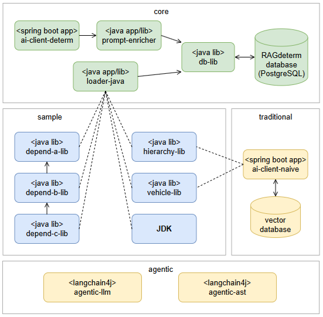

The **agentic-llm** application is one of the components of the **RAGdeterm** solution, 
which are presented below:

The **agentic-llm** application is an enhancement of the **ai-client-naive** project, in which the traditional 
RAG pipeline is replaced by an Agentic RAG solution.

The application description can be found in this document:

[Application architecture and functionality](docs/application-architecture-and-functionality.md)

Description of experiments conducted using **agentic-llm** are in two subsequent documents:

[Experiment](docs/experiment.md)

