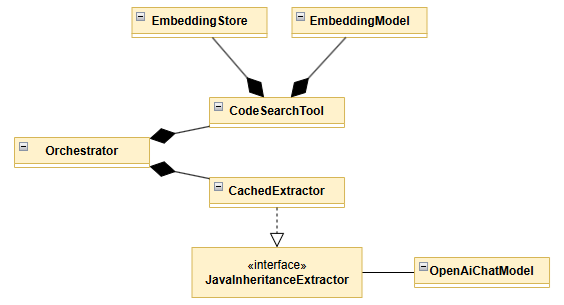
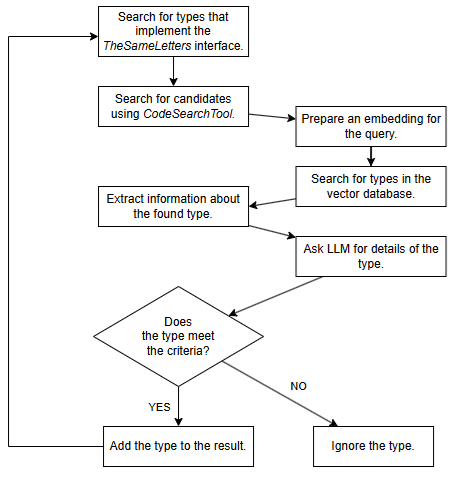
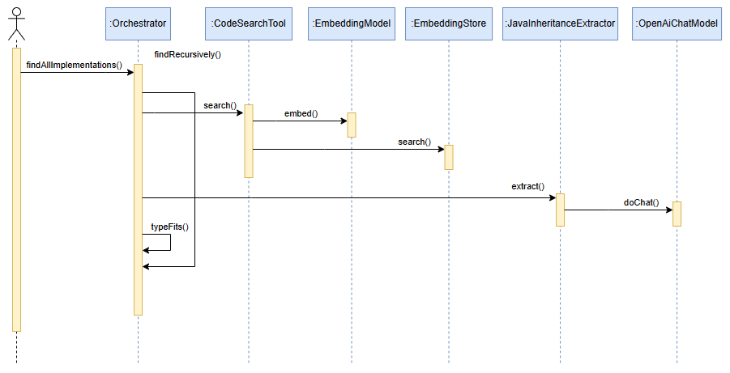

# Application Architecture and Functionality

The **agentic-llm** application is an example of an Agentic RAG solution. The application was created as an attempt to improve the effectiveness of the task described in the experiment [ai-client-naive / Experiment-1](../../ai-client-naive/docs/experiment-1.md).



The project was implemented using the *Langchain4j* framework, which—alongside SpringAI—is one of the two most popular AI frameworks for the Java language. The goal of this example is to create a mechanism that searches for all implementations of a specified interface in the Java language.

The simple pipeline used in the **ai-client-naive** example is replaced with an Agentic RAG–class solution. The central element here is the orchestrator (class `Orchestrator`), which cooperates with a code search tool (class `CodeSearchTool`) and a mechanism for extracting information about a class defined in the retrieved code fragment containing a type definition (class or interface) in Java.

The entire process can be traced in the `runTest` method of the test class `AgenticLlmIT`. Its execution begins with the creation of an embedding model instance (`EmbeddingModel`) and an LLM model instance (`OpenAiChatModel`). Next, a simple in-memory vector database (`EmbeddingStore`) is created. Source files located in directories specified by the `DIRECTORIES` constant are inserted into this database. In the experiment, these are files from the **hierarchy-lib** library. Once the database has been prepared and populated, the orchestrator and its components can be created. The basic search mechanism is executed by calling:

```java
List<JavaType> result = orchestrator.findAllImplementations(Config.IMPLEMENTATIONS_OF);
```

The algorithm of the Agentic RAG mechanism implemented in this example is presented in the block diagram and sequence diagram below.



The public method `findAllImplementations` invokes the `findRecursively` method, which is responsible for the main control flow. The first operation is a call to the `search` method of the `CodeSearchTool` class. Based on the query, an embedding is created and used to execute a query on the vector database. The result is a list of candidates, i.e., a list of types that may satisfy the search criteria, meaning they may implement the specified interface. However, this is only a hypothesis that requires verification.

To verify whether the retrieved type is correct, we use an object of type `CachedExtractor`. This class is an implementation that enriches the `JavaInheritanceExtractor` interface with a caching function. The `JavaInheritanceExtractor` interface itself is used to communicate with the LLM using the following prompt:

```text
Extract structural information from Java class or interface source code.

Return a JSON object with the following fields:
- pckg (full package name or null if none)
- typeName (name of the class or interface)
- superType
- implementedInterfaces (empty list if none)

Definitions:
- If the type is a class:
  - superType = the class specified after the `extends` keyword (null if none)
  - implementedInterfaces = all interfaces listed after the `implements` keyword

- If the type is an interface:
  - superType = the first interface listed after the `extends` keyword (null if none)
  - implementedInterfaces = all additional interfaces listed after the `extends` keyword beyond the first one (empty list if none)

Important:
- For interfaces, the `extends` keyword defines superinterfaces.
- Do not ignore `extends` in interfaces.
- Do not guess missing information.
- If the input does not define a class or interface, return all fields as null.

Return only valid JSON. Do not include explanations.
```

In this way, we verify whether the types retrieved from the vector database actually implement the specified interface. Each correct result is added to the cumulative result of the operation. Since implementation and inheritance may form a hierarchical structure, for each valid type we invoke the described mechanism again, recursively.



At this point, it is worth emphasizing the existence of two parameters:

```java
public static int MAX_RESULTS = 30;
public static double MIN_SCORE = 0.7;
```

These parameters have a significant impact on the final results of the experiments conducted using this example.

## Configuration and Initial Startup

The list of steps required to prepare the example for execution is short. A valid OpenAI API key must be inserted into the `API_KEY.VALUE` constant, and the correctness of the path to the source code (constant `Config.DIRECTORIES`) should be verified. Naturally, other settings can later be experimented with.

## Typical Usage Scenario

Running the example simply requires executing the test method `AgenticLlmIT.runTest`.

