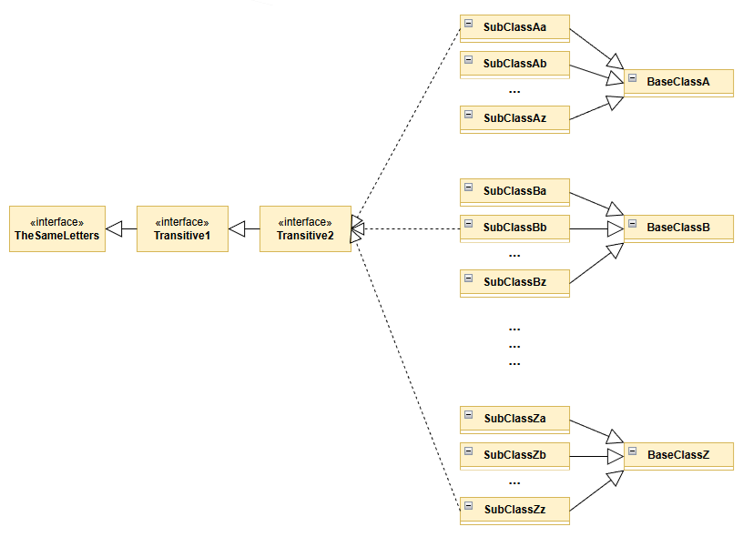
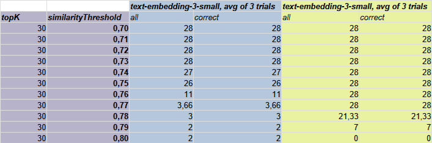
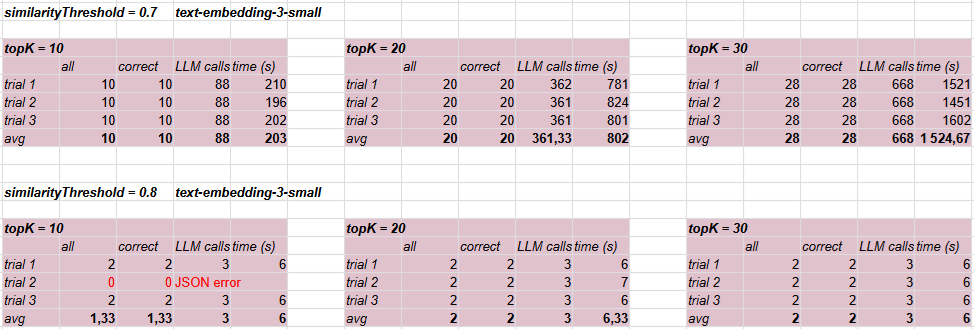
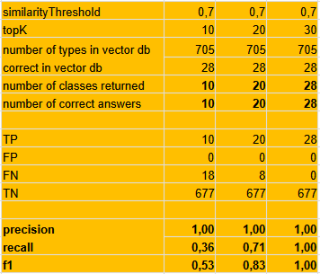

# Experiment agentic-llm

## Objective and Research Question

The objective of the experiment is to investigate whether, and to what extent, an Agentic RAG–based solution improves the results of the traditional RAG technique used in the experiment [ai-client-naive / Experiment-1](../../ai-client-naive/docs/experiment-1.md).

The experiment is based on a set of types (classes and interfaces) defined in the `hierarchy` project.

A large set of classes was generated with names `SubClazzAa`, `SubClazzAb`, `SubClazzAc`, and so on up to `SubClazzAz`.
Next, `SubClazzBa`, `SubClazzBb`, up to `SubClazzBz`, and so forth. This is illustrated in the figure below.
Selected classes—those in which the penultimate and last letters of the name are the same, e.g., `SubClazzAa`, `SubClazzBb`—implement the `TheSameLetters` interface. However, this interface is implemented indirectly through the `Transitive1` and `Transitive2` interfaces.



The question asked to the system is:

```text
Provide all types implementing the TheSameLetters interface.
```

The correct answer is the following list of types:

```text
Transitive1, Transitive2,
SubClassAa, SubClassBb, SubClassCc, SubClassDd, SubClassEe,
SubClassFf, SubClassGg, SubClassHh, SubClassIi, SubClassJj,
SubClassKk, SubClassLl, SubClassMm, SubClassNn, SubClassOo,
SubClassPp, SubClassQq, SubClassRr, SubClassSs, SubClassTt,
SubClassUu, SubClassVv, SubClassWw, SubClassXx, SubClassYy,
SubClassZz
```

(It should be noted that in the experiment [ai-client-naive / Experiment-1](../../ai-client-naive/docs/experiment-1.md) we asked only about classes rather than types. Therefore, the correct result there did not include the interfaces `Transitive1` and `Transitive2`. However, this difference does not affect the final comparison of the methods.)

The source code of the `hierarchy` project is loaded into the vector database.
The total number of classes in the vector database is 705.

| Project   | Number of classes |
| --------- | ----------------: |
| hierarchy |               705 |

## Experimental Design and Variables

The experiment consisted of invoking the Agentic RAG mechanism (method `Orchestrator.findAllImplementations`) for different combinations of the parameters `similarityThreshold` and `topK`, which in the Langchain4j framework are referred to as `MIN_SCORE` and `MAX_RESULTS`, respectively. The number of tested combinations was limited to the following:

```text
(0.7, 10), (0.7, 20), (0.7, 30)
(0.8, 10), (0.8, 20), (0.8, 30)
```



The decision to limit `similarityThreshold` to two values, `0.7` and `0.8`, was based on a preliminary experiment that showed a drastic change in answer quality occurring between these two values. The same preliminary experiment also indicated that a simpler embedding model, `text-embedding-3-small`, could be used.

The `topK` parameter was limited to `10`, `20`, and `30` (the default value in the library is `3`). During subsequent recursively invoked queries, the maximum number of correct results is `26` (names ranging from `Aa` to `Zz`).

## Procedure

For each combination of the parameters `similarityThreshold` and `topK`, the query was executed three times. In addition to the number of returned and correctly identified types, the response time and the number of requests sent to the LLM model were also measured.

## Metrics

The primary metrics used to evaluate the experimental results were **precision**, **recall**, and **F1 score**. Additionally, the response time and the number of requests made to the LLM were measured.

## Results

Correct results were obtained only for the parameter combination `(0.7, 30)`.



However, a large number of calls to the LLM system (668) and the response time (over 25 minutes) should be noted.



## Discussion

The first attempt to apply an Agentic RAG–based approach revealed two weaknesses. The first is the limitation related to selecting an appropriate value of the `topK` parameter (`MAX_RESULTS`). In our case, when querying for implementations of the `Transitive2` interface, the number of values returned by the vector database is `26`. Therefore, only for the parameter value `30` do we obtain `recall = 1`. In real-world projects, it may be difficult to estimate the correct value of this parameter. Setting a high value will of course produce a correct answer, but at the cost of a large number of unnecessary LLM calls.

The waiting time for LLM responses is the second drawback of the described solution. The performance issue is addressed in the **agentic-ast** example.

---

*All tests were performed on a computer with an AMD Ryzen 5 3.2 GHz processor, Samsung 980 SSD, and 32 GB of RAM.*
