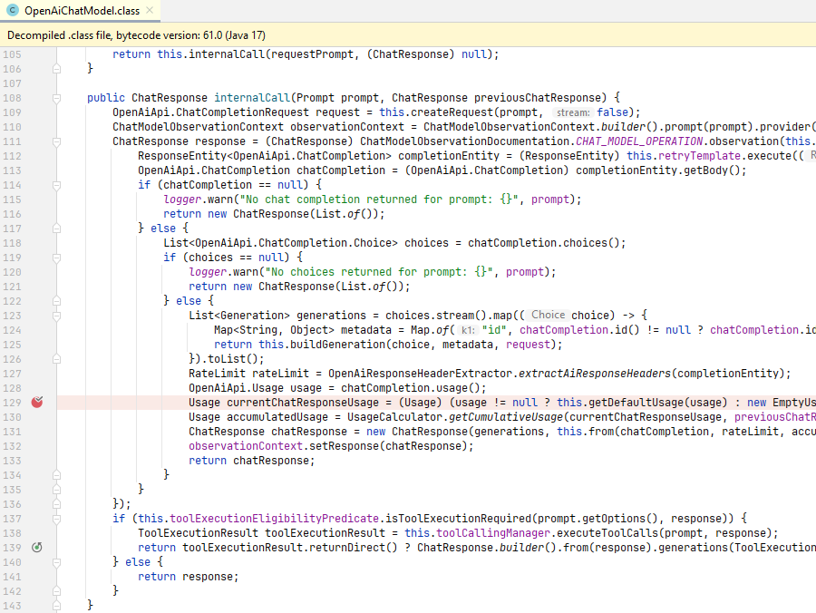
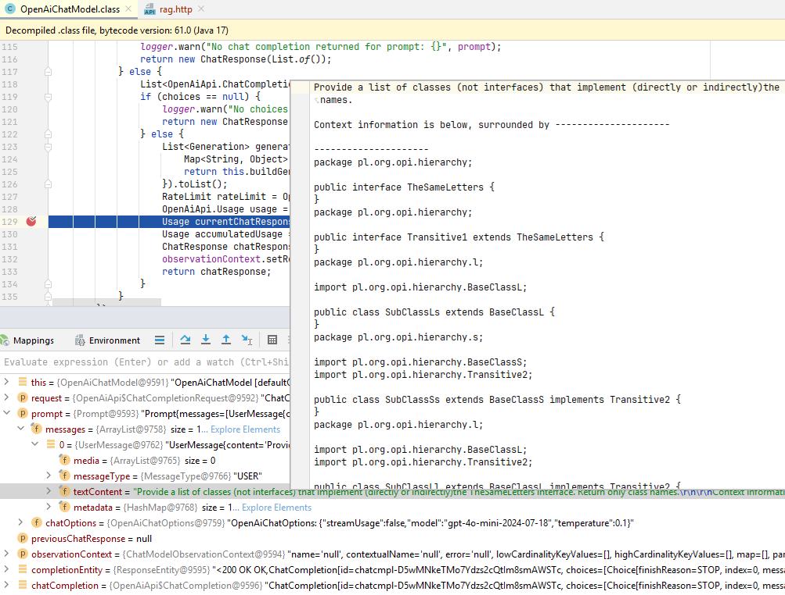

# Application Architecture and Functionality

The **ai-client-naive** application is an example built using the Spring Boot framework and the Spring AI library. 
The key component of the application is the REST controller `RagChatController`, which sends queries to the LLM system:

```java
@GetMapping("/rag")
public String chat(@RequestParam(defaultValue = "Hello, how are you?") String query) {
    return chatClient
            .prompt()
            .messages(List.of(new UserMessage(query)))
            .call()
            .content();
}
```

The LLM client of type `ChatClient` is configured to use the RAG mechanism implemented by 
an object of type `QuestionAnswerAdvisor`. 

```java
private final ChatClient chatClient;

public RagChatController(ChatClient.Builder builder, VectorStore vectorStore) {
    QuestionAnswerAdvisor questionAnswerAdvisor = QuestionAnswerAdvisor.builder(vectorStore)
            .searchRequest(
                    SearchRequest.builder()
                            .similarityThreshold(0.2d)
                            .topK(10)
                            .build()
            )
            .build();
    this.chatClient = builder
            .defaultAdvisors(questionAnswerAdvisor)
            .build();
}
```

```java
@Configuration
public class AppConfig {
    @Bean
    VectorStore vectorStore(EmbeddingModel embeddingModel) {
        return SimpleVectorStore.builder(embeddingModel).build();
    }
}
```


The `QuestionAnswerAdvisor` enriches prompts before 
sending them to the LLM by querying a vector database, implemented as a `SimpleVectorStore` that persists 
the vector data in a file (excerpt below):

```text
"52e76b06-4805-465e-96ac-eec7193b29b0" : {
"text" : "package pl.org.opi.vehicle.land.car;\r\n\r\nimport pl.org.opi.vehicle.LandVehicle;
\r\nimport pl.org.opi.vehicle.component.level2.*;
\r\nimport pl.org.opi.vehicle.utility.*;\r\n\r\npublic abstract class Car extends LandVehicle {\r\n    
private EngineSystem engineSystem;\r\n    private TransmissionSystem transmissionSystem;\r\n    
private ElectricalSystem electricalSystem;\r\n    private SuspensionSystem suspensionSystem;\r\n    
private BodyStructure bodyStructure;\r\n    private InteriorSystem interiorSystem;\r\n    
private Tire[] tires;\r\n    private FuelType fuelType;\r\n    private NavigationSystem navigationSystem;\r\n    
private SafetySystem safetySystem;\r\n    private AirCondition airCondition;\r\n    
private InfotainmentSystem infotainmentSystem;",
"embedding" : [ 0.011968396, -0.019814001, -0.0070418166, 0.013575976, 0.0038420397, 
0.003830502, -0.029813305, 0.0078109936, -0.002282533, -0.026675062, 0.056273, 0.0034497592, 
0.016752677, -0.022229219, -0.021290822, 0.045350682, -0.05941124, 0.0026382774, -0.030013291, 
-0.005507308, 0.03618209, 0.0060649617, 0.023998326, 0.0034343759, -0.028259566, 0.015629679, 
0.026721213, 2.275983E-6, -0.059442006, -0.030951686, 0.00529963, 0.0063726325, 0.015752748, 
0.01672191, 0.04030488, -0.023998326, -0.009114749, 0.012952942, 0.003559367, 0.0035112936, 
0.04473534, -0.001005699, -0.004468919, 0.049627308, -0.0137759615, 0.030059442, -0.019337112, 0.015606604
...
...
```

The project also includes a `SourceReader` component which, depending on the configuration parameter `create.store`, 
either loads Java source code into the vector database or opens and loads a previously 
saved vector database from a file.

## Configuration and Initial Startup

Before running the application for the first time, the application parameters must be verified and 
adjusted in the `application.properties` file:

```text
spring.application.name=ai-client-naive
server.port=8883
spring.ai.openai.api-key=<KEY>
spring.ai.openai.chat.options.temperature=0.1

## spring.ai.openai.chat.options.model=gpt-3.5-turbo
## spring.ai.openai.chat.options.model=gpt-4o-2024-11-20
spring.ai.openai.chat.options.model=gpt-4o-mini-2024-07-18
## spring.ai.openai.chat.options.model=gpt-5-mini-2025-08-07

## spring.ai.openai.embedding.options.model=text-embedding-3-small
spring.ai.openai.embedding.options.model=text-embedding-3-large

create.store=false
## vector.file.name=vector-db-embedding-3-small.json
vector.file.name=vector-db-embedding-3-large.json

source.folder.1=c:/ragdeterm/hierarchy-lib/src/main/java
source.folder.2=c:/ragdeterm/vehicle-lib/src/main/java
source.folder.3=c:/ragdeterm/person-lib/src/main/java
source.folder.4=c:/ragdeterm/depend-a-lib/src/main/java
source.folder.5=c:/ragdeterm/depend-b-lib/src/main/java
source.folder.6=c:/ragdeterm/depend-c-lib/src/main/java
```

The first step is to assign a valid OpenAI API key to the `spring.ai.openai.api-key` parameter. 
Below it, several LLM and embedding models are listed. For the experiments described, the following combination 
was used (in the first experiment, both `small` and `large` embeddings were used):

```text
spring.ai.openai.chat.options.model=gpt-4o-mini-2024-07-18
##spring.ai.openai.embedding.options.model=text-embedding-3-small
spring.ai.openai.embedding.options.model=text-embedding-3-large
```

In the experiments, the focus is on RAG-generated hints rather than the output of the LLM itself; therefore, 
a simpler LLM model (e.g., `gpt-4o-mini`) can be used. From our perspective, the embedding model is more important.

An important parameter is `create.store`. When set to `true`, Java source files are loaded into the vector 
database and the database itself is saved to a file. When set to `false`, the database is loaded from an existing file.

```java
@PostConstruct
public void load() {
    if (env.getProperty("create.store").equalsIgnoreCase("true")) {
        findSourceFolders().forEach((key, value) -> {
            iterateJavaSourceFiles(("" + value).trim());
        });
        ((SimpleVectorStore) vectorStore).save(new File(env.getProperty("vector.file.name")));
    } else {
        ((SimpleVectorStore) vectorStore).load(new File(env.getProperty("vector.file.name")));
    }
}
```

A typical workflow involves setting `create.store` to `true`, running the application to build the vector database, 
then stopping the application, setting `create.store` to `false`, and running the application again in query mode.

The parameters `source.folder.1`, `source.folder.2`, etc., point to directories containing Java source files. 
Any number of such parameters can be used, as long as their names start with `source.folder`:

```java
public Map<String, Object> findSourceFolders() {
    Map<String, Object> result = new HashMap<>();
    if (env instanceof ConfigurableEnvironment configurableEnv) {
        for (PropertySource<?> ps : configurableEnv.getPropertySources()) {
            if (ps instanceof EnumerablePropertySource<?> eps) {
                for (String name : eps.getPropertyNames()) {
                    if (name.startsWith("source.folder")) {
                        result.put(name, eps.getProperty(name));
                    }
                }
            }
        }
    }
    return result;
}
```

## Typical Usage Scenario

Below are the successive steps of a typical application usage scenario. After starting the application, 
the REST service is invoked, for example as shown below:

```text
http://localhost:8883/rag?query=
    Provide a list of classes (not interfaces) that implement (directly or indirectly)
    the TheSameLetters interface. Return only class names.
```

The request is handled by the controller:

```java
@GetMapping("/rag")
public String chat(@RequestParam(defaultValue = "Hello, how are you?") String query) {
    return chatClient
            .prompt()
            .messages(List.of(new UserMessage(query)))
            .call()
            .content();
}
```

Thanks to the appropriate configuration, the prompt is enriched before being sent to the LLM by 
an instance of the `QuestionAnswerAdvisor` class, which uses the prepared vector database. 
After enrichment, the prompt is forwarded to the LLM model.

From the perspective of the conducted experiments, the content with which the prompt is enriched is of primary interest. 
There is an easy way to inspect it. Open the `OpenAiChatModel` class (in IntelliJ, press `Ctrl+N`) 
and set a breakpoint at the location shown in the figure below:



The enriched prompt content can be found in the `messages` field of the `prompt` object:



Access to the enriched prompt can also be obtained by creating an additional `CallAdvisor` object. 
An example is shown below:

```java
@Slf4j
public class PromptLoggingAdvisor implements CallAdvisor {

    public static String path = "C:\\ragdeterm\\ai-client-naive\\docs\\" +
            "experiment-2-data\\embedding-3-large\\" +
            "similarityThreshold-08";
    public static String emb = "3-large";
    public static double sTh = 0.8;
    public static int topK = 1000;
    public static int trial = 1;

    @Override
    public ChatClientResponse adviseCall(ChatClientRequest chatClientRequest, CallAdvisorChain callAdvisorChain) {

        String fileName = String.format(
                Locale.US,
                "emb-%s-sTh-%.1f-topK-%d-trial-%d.txt",
                emb, sTh, topK, trial
        );
        String fullFileName = path + "\\" + fileName;
        String text = chatClientRequest.prompt().toString();
        try {
            FileUtils.writeStringToFile(new File(fullFileName), text, StandardCharsets.UTF_8);
        } catch (IOException e) {
            throw new RuntimeException(e);
        }

        ChatClientResponse chatClientResponse = callAdvisorChain.nextCall(chatClientRequest);
        return chatClientResponse;
    }

    @Override
    public String getName() {
        return "PromptLoggingAdvisor";
    }

    @Override
    public int getOrder() {
        return 100;
    }

}
```

```java
this.chatClient = builder
    .defaultAdvisors(questionAnswerAdvisor, new PromptLoggingAdvisor())
    .build();
```
