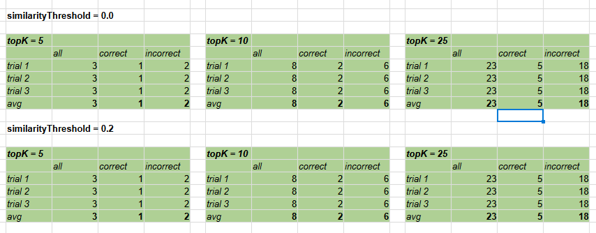
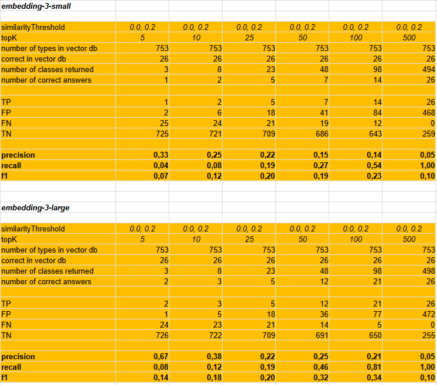

# Experiment 1

## Objective and Research Question

The objective of the experiment is to determine whether the traditional RAG of the `ai-client-naive` application 
is capable of properly enriching the following prompt:

```text
###
http://localhost:8883/rag?query=
    Provide a list of classes (not interfaces) that implement (directly or indirectly)
    the TheSameLetters interface. Return only class names.
```

The prompt concerns classes defined in the `hierarchy` project, in which a large set of classes was generated 
with names `SubClazzAa`, `SubClazzAb`, `SubClazzAc`, and so on up to `SubClazzAz`. 
Next, `SubClazzBa`, `SubClazzBb`, up to `SubClazzBz`, and so forth. This is illustrated in the figure below.
Selected classes—those in which the penultimate and last letters of the name are the same, 
e.g., `SubClazzAa`, `SubClazzBb`—implement the `TheSameLetters` interface. 
However, this interface is implemented indirectly, through the `Transitive1` and `Transitive2` interfaces.


The correct answer to the query (and the correct RAG hint) should be the following list of classes:

```text
SubClassAa, SubClassBb, SubClassCc, SubClassDd, SubClassEe,
SubClassFf, SubClassGg, SubClassHh, SubClassIi, SubClassJj,
SubClassKk, SubClassLl, SubClassMm, SubClassNn, SubClassOo,
SubClassPp, SubClassQq, SubClassRr, SubClassSs, SubClassTt,
SubClassUu, SubClassVv, SubClassWw, SubClassXx, SubClassYy,
SubClassZz
```

The source code of the `hierarchy` project is loaded into the vector database. The database also contains other projects.
The total number of classes in the vector database is 753.

| Project   | Number of classes |
|-----------|------------:|
| hierarchy |         705 | 
| vehicle   |          32 | 
| person    |           7 | 
| depend-a  |           3 | 
| depend-b  |           3 | 
| depend-c  |           3 | 

## Experimental Design and Variables

The experiment was conducted by repeatedly issuing the following prompt:

```text
###
http://localhost:8883/rag?query=
    Provide a list of classes (not interfaces) that implement (directly or indirectly)
    the TheSameLetters interface. Return only class names.
```

and examining its content after enrichment by RAG. The operation was executed multiple times for the following combinations of parameters `similarityThreshold` and `topK`:

```text
(0.0, 5), (0.0, 10), (0.0, 25), (0.0, 50), (0.0, 100), (0.0, 500)
(0.2, 5), (0.2, 10), (0.2, 25), (0.2, 50), (0.2, 100), (0.2, 500)
(0.4, 5), (0.4, 10), (0.4, 25), (0.4, 50), (0.4, 100), (0.4, 500)
(0.6, 5), (0.6, 10), (0.6, 25), (0.6, 50), (0.6, 100), (0.6, 500)
(0.8, 5), (0.8, 10), (0.8, 25), (0.8, 50), (0.8, 100), (0.8, 500)
```

Moreover, the experiment was conducted using two different embeddings:

```text
spring.ai.openai.embedding.options.model=text-embedding-3-small
spring.ai.openai.embedding.options.model=text-embedding-3-large
```

## Procedure

For each of the above combinations, the prompt was sent three times, and its enriched version was saved to a file with an appropriate name, for example:

```text
emb-3-large-sTh-0.0-topK-25-trial-1.txt
emb-3-large-sTh-0.0-topK-25-trial-2.txt
emb-3-large-sTh-0.0-topK-25-trial-3.txt
```

Next, in each file, declarations of all classes added by RAG were identified. It was then checked what the total 
number of included classes was (`all`), how many were included correctly (`correct`), and how many were 
unnecessary (`incorrect`).
The average was calculated from the three trials.




## Metrics

Three metrics were used in the experiment:\
**M1** – the ratio of the number of correctly retrieved classes to the number of expected classes
(in this experiment, 26 classes, from `SubClassAa` to `SubClassZz`, were expected).\
**M2** – the ratio of the number of correctly retrieved classes to all classes used to enrich the prompt.\
**M3** – the ratio of incorrectly added classes to all added classes — informational noise.

## Results

*(All results are available in the spreadsheet `experiment-1.ods` included in the project.)*

The results for the `small` and `large` embeddings are shown in the figure below:



## Discussion

The results show that traditional RAG is not able to capture semantic relationships between elements of source code.
The only case in which all 26 expected classes were retrieved occurs at a very high `topK`. However, obtaining this result is associated with very low precision (`0.05`) and very high informational noise (`0.95`). Thus, prompt enrichment for `similarityThreshold = 0.0, 0.2` and `topK = 500` effectively resembles a brute-force operation.

The responses obtained for other parameter combinations are unsatisfactory, with the possible exception of `topK = 100` when using `embedding-3-large`.

It is also worth noting the better performance of `embedding-3-large` compared to `embedding-3-small`.

---

_All tests were performed on a computer with an AMD Ryzen 5, 3.2GHz processor, Samsung 980 SSD, and 32 GB of RAM._