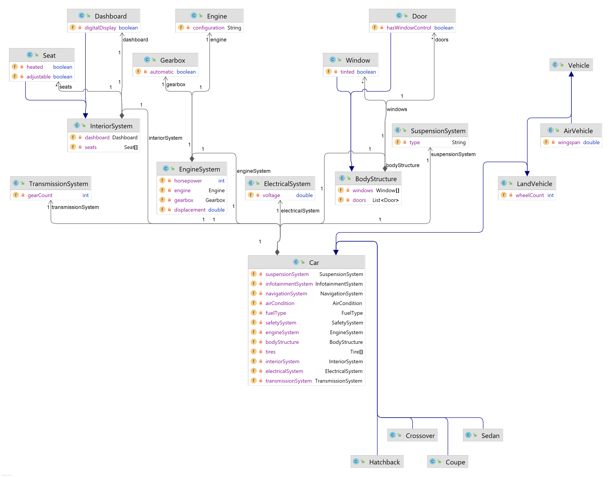
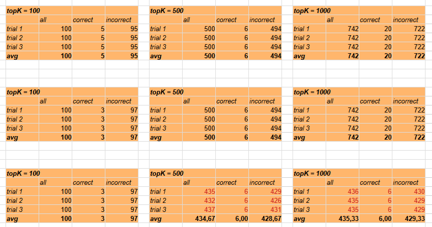
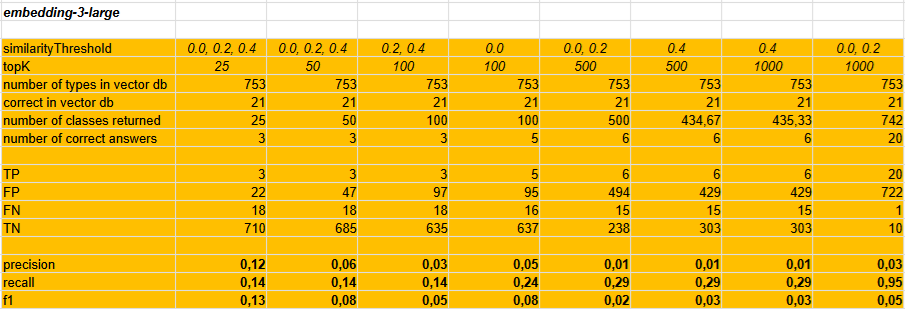

# Experiment 2

## Objective and Research Question

The objective of the experiment is to determine whether the traditional RAG of the `ai-client-naive` application is capable of properly enriching the following prompt:

```text
###
http://localhost:8883/rag?query=
    You are given the fully qualified Java class name:
    "pl.org.opi.vehicle.land.car.subtypes.Hatchback"
    Your task is to identify and output the complete context of this class.
    The context MUST include:
    1. All direct and indirect superclass(es) of the given class.
    2. All non-primitive, non-Java-standard-library classes used as types of the fields listed above
   (including field types declared in superclasses).
    Constraints:
    - Exclude any classes from the Java standard library (e.g., java.*, javax.*).
    - Assume standard Java inheritance and field visibility rules.
    Output requirements:
    - Output ONLY the Java source code of all identified classes.
    - Do NOT add comments, explanations, headings, or extra text.
    - Each class must be complete and syntactically correct.
    - Preserve correct package declarations.
```




The prompt concerns classes defined in the `vehicle` project. This project defines a set of classes describing vehicles, their types, relationships between them, and their structure (parts). In total, 32 types are defined in the project. The experiment queries the context of the `Hatchback` class; the correct answer consists of 21 types:

```text
ElectricalSystem, EngineSystem, InteriorSystem, Dashboard, Door,
Engine, Gearbox, Seat, Window, SuspensionSystem,
TransmissionSystem, Car, Hatchback, LandVehicle, AirCondition,
FuelType, InfotainmentSystem, NavigationSystem, SafetySystem, Tire,
Vehicle
```

The source code of the `vehicle` project is loaded into the vector database. The database also contains other projects.
The total number of classes in the vector database is 753.

| Project   | Number of classes |
| --------- | ----------------: |
| hierarchy |               705 |
| vehicle   |                32 |
| person    |                 7 |
| depend-a  |                 3 |
| depend-b  |                 3 |
| depend-c  |                 3 |

## Experimental Design and Variables

The experiment was conducted by repeatedly issuing the prompt requesting the context of the class
`pl.org.opi.vehicle.land.car.subtypes.Hatchback` and examining its content after enrichment by RAG. The operation was executed multiple times for the following combinations of the `similarityThreshold` and `topK` parameters:

```text
(0.0, 25), (0.0, 50), (0.0, 100), (0.0, 500), (0.0, 1000)
(0.2, 25), (0.2, 50), (0.2, 100), (0.2, 500), (0.2, 1000)
(0.4, 25), (0.4, 50), (0.4, 100), (0.4, 500), (0.4, 1000)
(0.6, 25), (0.6, 50), (0.6, 100), (0.6, 500), (0.6, 1000)
(0.8, 25), (0.8, 50), (0.8, 100), (0.8, 500), (0.8, 1000)
```

The experiment was conducted using a `large` embedding:

```text
spring.ai.openai.embedding.options.model=text-embedding-3-large
```

## Procedure

For each of the above combinations, the prompt was sent three times, and its enriched version was saved to a file with an appropriate name, for example:

```text
emb-3-large-sTh-0.0-topK-1000-trial-1.txt
emb-3-large-sTh-0.0-topK-1000-trial-2.txt
emb-3-large-sTh-0.0-topK-1000-trial-3.txt
```

Next, in each file, declarations of all classes added by RAG were identified. It was then checked what the total number of included classes was (`all`), how many were included correctly (`correct`), and how many were unnecessary (`incorrect`).
The average was calculated from the three trials.



## Metrics

The metrics used to evaluate the experimental results are:
**precision**, **recall**, and **F1 score**.

## Results

*(All results are available in the spreadsheet `experiment-2.ods` included in the project.)*

The results are shown in the figure below:



## Discussion

The results show that traditional RAG is not able to capture semantic relationships between elements of source code.
In none of the cases did the enriched prompt contain all 21 required types. The best result was 20 types, obtained at the maximum `topK`. Achieving this result is associated with very low precision (`0.03`) and very high informational noise (`0.97`). Thus, prompt enrichment for `similarityThreshold = 0.0, 0.2` and `topK = 1000` effectively resembles a brute-force operation.

The responses obtained for other parameter combinations are unsatisfactory.

---

_All tests were performed on a computer with an AMD Ryzen 5, 3.2GHz processor, Samsung 980 SSD, and 32 GB of RAM._