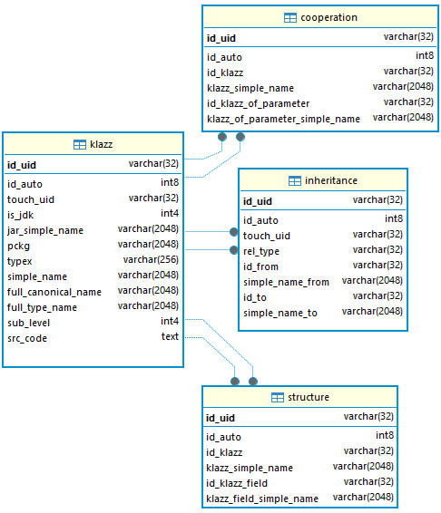

## Library Architecture and Functionality

The project consists of two main packages.

The `dbaccess` package contains a set of core classes that enable database access.
It is a proprietary, very simple yet effective solution for building a data access layer
without using external frameworks—only JDBC and a database driver are required.
This package includes classes responsible for connection handling, connection pooling,
a custom transaction abstraction, base classes for repositories, SQL statement handling,
and a set of simple helper utilities.

The `ragdeterm` package contains a collection of entity and repository definitions created
to support the RAGdeterm tables.
The structure diagram of these tables is shown below:



Entity classes use the `Entity` suffix, while basic CRUD repositories are classes with the `Repo` suffix
(these classes are not implemented manually—they are generated automatically).
Additional methods (most often custom queries) that go beyond the standard functionality
are placed in classes with the `Repox` suffix.

The `ragdeterm` package also includes low-level tools for building RAGdeterm-type contexts.
These are the classes `CooperationCtxRepox`, `FullCtxRepox`, and `StructureCtxRepox`.

## Configuration and Initial Startup

Before starting work with RAGdeterm, a database must be created.
The project uses a PostgreSQL database.
The scripts for creating the database are located in the `src/main/resources/sql` folder of the project.
First, the database itself is created (`_create_db.txt`), followed by the tables (`create_table.sql`).

After creating the database, the correct URL should look as follows (assuming the default port):

```text
jdbc:postgresql://localhost:5432/ragdeterm?currentSchema=rag
```

## Typical Usage Scenario

The **db-lib** project is a library used by other modules.
A typical usage scenario can be found in several test classes included in the project.

First, database access must be defined as a set of connection pool parameters (the Hikari library is used).
This is done using the following code:

```java
DbConnContainer.addDbConn(new DbConnConfig("Default",
        Consta.CONN_URL, Consta.CONN_USER, Consta.CONN_PSW, Consta.CONN_DRIVER,
        false, 20, 180000
));
```

where the following constants are used:

```java
static public final String CONN_URL = "jdbc:postgresql://localhost:5432/ragdeterm?currentSchema=rag";
static public final String CONN_USER = "ragdeterm";
static public final String CONN_PSW = "ragdeterm";
static public final String CONN_DRIVER = "org.postgresql.ds.PGSimpleDataSource";
```

The `DbConnContainer.addDbConn` method is static and defines the default connection pool
(the library supports multiple pools, but the RAGdeterm project uses only one).

Database operations are always executed within a block similar to the one below:

```java
try (var trx = DbConnContainer.newTrx()) {

    ...
    ...

    trx.commit();
} catch (Exception ex) {
    throw new DbException(ex.getMessage(), ex);
}
```

The `DbConnContainer.newTrx()` method creates and retrieves a new database connection
from the default pool.


