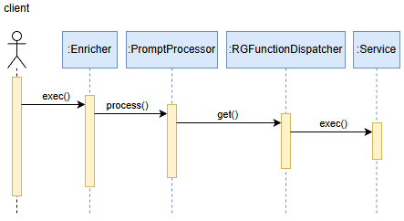

## Library Architecture and Functionality

The **prompt-enricher** project is a library, but it can also operate as a command-line application.
The purpose of the library is to enrich prompts. The process is supervised by the `Enricher` class, while the actual prompt enrichment is handled by the `PromptProcessor` class.

Below is an example invocation:

```java
String prompt = """
        ClassesInheritedAnyLevel
        [*RG ClassesInheritedAnyLevel("pl.org.opi.vehicle.land.car.Car", "", LONG_NAME, "", "", "\n") *RG]
        """;
var enricher = new Enricher();
enricher.setConnUrl(CONN_URL);
enricher.setConnUser(CONN_USER);
enricher.setConnPsw(CONN_PSW);
enricher.setConnDriver(CONN_DRIVER);
String rslt = enricher.exec(prompt);
```

Result:

```text
pl.org.opi.vehicle.land.car.subtypes.Coupe
pl.org.opi.vehicle.land.car.subtypes.Crossover
pl.org.opi.vehicle.land.car.subtypes.Hatchback
pl.org.opi.vehicle.land.car.subtypes.Sedan
```



The `Enricher` class initializes a connection to the RAGdeterm database and then calls:

```java
PromptProcessor.process(prompt);
```

`PromptProcessor` starts by searching the prompt for expressions of the form:

```text
[*RG ClassesInheritedAnyLevel("pl.org.opi.vehicle.land.car.Car", "", LONG_NAME, "", "", "\n") *RG]
```

There may be multiple such expressions in a single prompt. Each expression is parsed and passed to `RGFunctionDispatcher`, where the function name is mapped to the corresponding implementation:

```java
    private static final Map<String, Function<List<String>, String>> FUNCTIONS =
            new HashMap<>();

    static {
        FUNCTIONS.put("ClassesInheritedAnyLevel", RGFunctions::classesInheritedAnyLevelService);
        FUNCTIONS.put("ClassesInheritedDirectly", RGFunctions::classesInheritedDirectlyService);
        FUNCTIONS.put("IfaceImplementationsAnyLevel", RGFunctions::ifaceImplementationsAnyLevelService);
        FUNCTIONS.put("IfaceImplementationsDirectly", RGFunctions::ifaceImplementationsDirectlyService);
        FUNCTIONS.put("PackageTypesAnyLevel", RGFunctions::packageTypesAnyLevelService);
        FUNCTIONS.put("PackageTypesDirectly", RGFunctions::packageTypesDirectlyService);
        FUNCTIONS.put("SelectedJarPackageTypesAnyLevel", RGFunctions::selectedJarPackageTypesAnyLevelService);
        FUNCTIONS.put("StructureContext", RGFunctions::structureContextService);
        FUNCTIONS.put("CooperationContext", RGFunctions::cooperationContextService);
        FUNCTIONS.put("StruCoopContext", RGFunctions::struCoopContextService);
    }
```

An example function implementation looks as follows:

```java
public static String packageTypesAnyLevelService(List<String> args) {
    String pckgName = args.get(0);
    EnumAnswerType answerType = EnumAnswerType.fromString(args.get(1));
    String prefix = NewLine.replaceEscapedNewlines(args.get(2));
    String suffix = NewLine.replaceEscapedNewlines(args.get(3));
    String separator = NewLine.replaceEscapedNewlines(args.get(4));
    PackageTypesAnyLevelService service = new PackageTypesAnyLevelService();
    return service.exec(pckgName,
            answerType, prefix, suffix, separator);
}
```

Implementation of the `PackageTypesAnyLevelService` service:

```java
private String execCore(String pckgName, EnumAnswerType answerType, String prefix, String suffix, String separator) {
    List<KlazzEntity> rslt;

    try (var trx = DbConnContainer.newTrx()) {
        var klazzRepox = new KlazzRepox(trx);
        rslt = new ArrayList<>(klazzRepox.findPackageStartsWith(pckgName));
    } catch (Exception ex) {
        log.error(ex.getMessage(), ex);
        throw new DbException(ex.getMessage(), ex);
    }

    return switch (answerType) {
        case SHORT_NAME -> new RsltShortName(rslt, prefix, suffix, separator).exec();
        case LONG_NAME -> new RsltLongName(rslt, prefix, suffix, separator).exec();
        case ID -> new RsltId(rslt, prefix, suffix, separator).exec();
        case SOURCE_CODE -> new RsltSourceCode(rslt, prefix, suffix, separator).exec();
    };
}
```

It can be seen that package lookup is performed by the `findPackageStartsWith` method of the `KlazzRepox` class, which means that in this case (as well as in many others) the logic resides in the `db-lib` module.

## Typical Usage Scenario

The `Enricher` class can be invoked from another application, treating the **prompt-enricher** project as a library:

```java
String prompt = """
        ClassesInheritedAnyLevel
        [*RG ClassesInheritedAnyLevel("pl.org.opi.vehicle.land.car.Car", "", LONG_NAME, "", "", "\n") *RG]
        """;
var enricher = new Enricher();
enricher.setConnUrl(CONN_URL);
enricher.setConnUser(CONN_USER);
enricher.setConnPsw(CONN_PSW);
enricher.setConnDriver(CONN_DRIVER);
String rslt = enricher.exec(prompt);
```

Alternatively, **prompt-enricher** can be invoked from the command line:

```text
c:\ragdeterm>java 
-jar c:\ragdeterm\prompt-enricher\target\prompt-enricher-0.0.5-jar-with-dependencies.jar   
--connUrl="jdbc:postgresql://localhost:5432/ragdeterm?currentSchema=rag" 
--connUser=ragdeterm  
--connPsw=ragdeterm  
--connDriver=org.postgresql.ds.PGSimpleDataSource 
--prompt="[*RG ClassesInheritedAnyLevel(""pl.org.opi.vehicle.land.car.Car"", """", LONG_NAME, """", """", ""\n"") *RG]"

pl.org.opi.vehicle.land.car.subtypes.Coupe
pl.org.opi.vehicle.land.car.subtypes.Crossover
pl.org.opi.vehicle.land.car.subtypes.Hatchback
pl.org.opi.vehicle.land.car.subtypes.Sedan
```

## Adding a New Function

This section describes how to add additional functions supported by RAGdeterm. Below, the complete process of adding a very simple function that concatenates strings is presented. We will call it `Concat`, and it will accept an arbitrary number of parameters.

Function implementation in the `RGFunctions` class:

```java
public static String concatService(List<String> args) {
    return args.stream().map(Object::toString).collect(Collectors.joining());
}
```

Function registration in the `RGFunctionDispatcher` class:

```java
FUNCTIONS.put("Concat", RGFunctions::concatService);
```

Example invocation:

```java
String prompt = """
        [*RG Concat("Hello", "-", "world") *RG]
        """;
var enricher = new Enricher();
enricher.setConnUrl(CONN_URL);
enricher.setConnUser(CONN_USER);
enricher.setConnPsw(CONN_PSW);
enricher.setConnDriver(CONN_DRIVER);
String rslt = enricher.exec(prompt);
```
